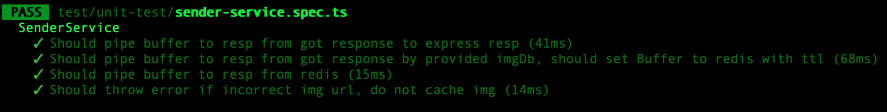
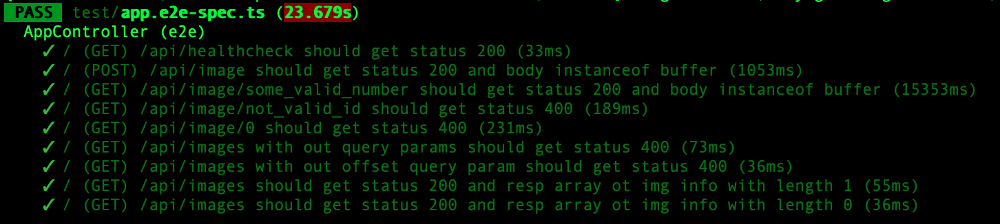
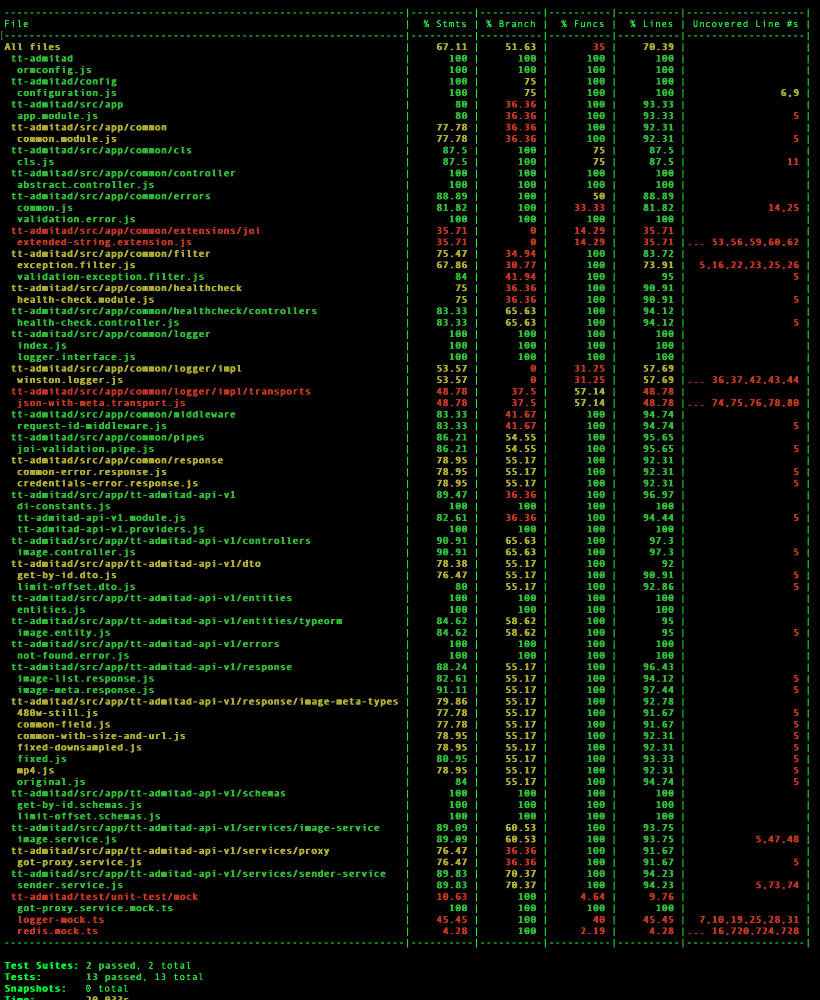

## Запуск локально:

1. `cp variables.sample.env variables.env` (конфиг берется из env параметров, описание их есть в sample файле)
2. `make dev-init`
3. `make dev-up`

## Скрипты запуска:

1. start.sh - запуск приложения.
2. migrations.sh - выполнение миграций.
3. dev.sh выполнение миграций + тестовые данные + запуск в watch and rebuild режиме.

## Зависимости:

1. Postgres
2. Redis
3. Nginx

# Порты:

    - app port: 9080
    - redis port: 6379
    - postgres port: 5432
    - nginx port: 80

# Тесты

1. unit: 
    - npm run test - тесты для SenderService, кэширование и отправка файлов клиенту
    
2. e2e: 
    - make dev-up
    - npm run test:e2e - тесты по ручкам api
    
3. coverage: 
    - make dev-up
    - npm run test:cov
    